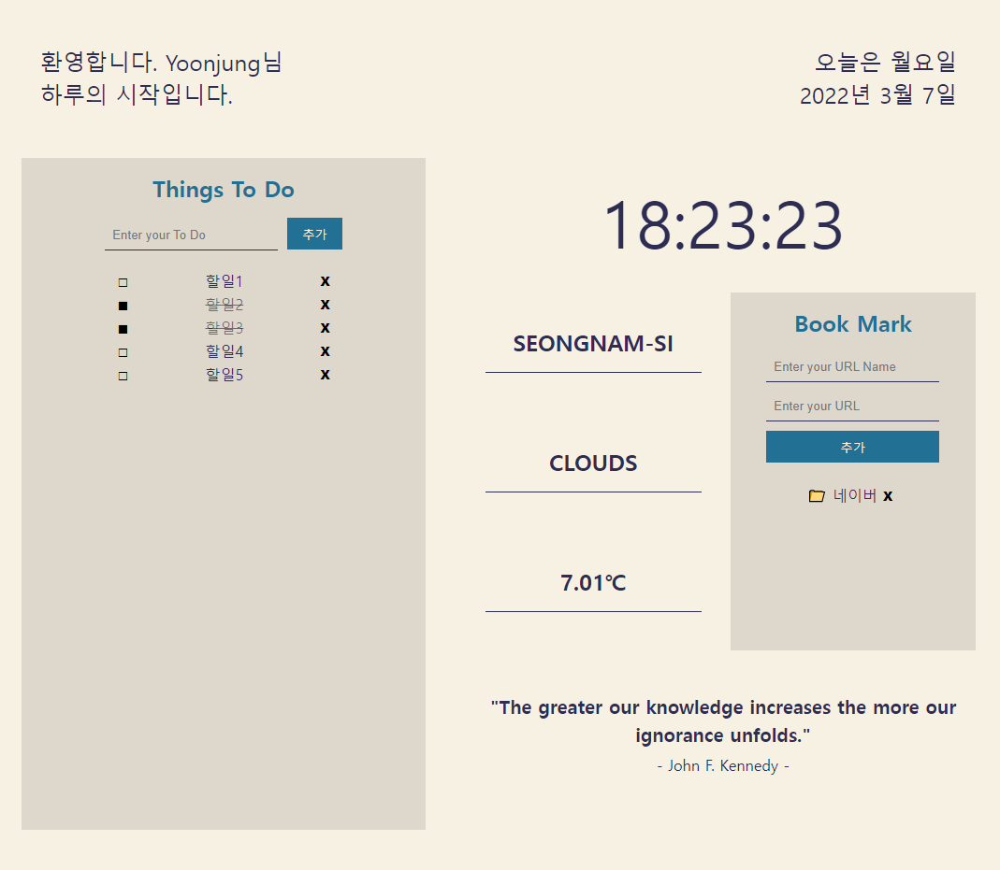

# 하루의 시작

## 개요

`React` `TypeScript` `styled-components` `localstorage` `Weather API` `Random Quete API`

- 크롬 앱 'Momentum'에서 영감을 받아 제작한 하루의 시작을 함께 할 수 있는 페이지

## 기능

- username을 입력하여 로그인을 합니다.
- 추가/삭제/상태변경이 가능한 ToDoList를 제공합니다.
- 오늘 날짜와 현재 시각을 초단위로 제공합니다.
- API를 이용하여 현재 위치와 날씨, 온도를 제공합니다.
- 추가/삭제가 가능한 Bookmark를 제공합니다.
- API를 이용하여 랜덤하게 명언을 제공합니다.
- 가로 최대 크기가 1000px 이하 일때 세로모드를 제공합니다.
